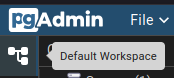
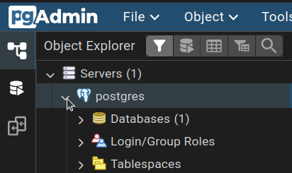
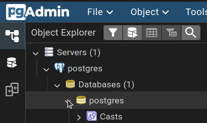

# Try Postgres

- [1. Required steps](#1-required-steps)
  - [1.1. Install `Docker Compose`](#11-install-docker-compose)
  - [1.2. Clone this repo](#12-clone-this-repo)
    - [1.2.1. Generate a token](#121-generate-a-token)
  - [1.3. Open the lab directory](#13-open-the-lab-directory)
  - [1.4. Create a `.env` file](#14-create-a-env-file)
  - [1.5. (If you use `Docker Desktop`) Start `Docker Engine`](#15-if-you-use-docker-desktop-start-docker-engine)
  - [1.6. Remove old containers](#16-remove-old-containers)
  - [1.7. Run containers](#17-run-containers)
  - [1.8. Connect `pgAdmin` to the database](#18-connect-pgadmin-to-the-database)
  - [1.9. Go to `postgres`](#19-go-to-postgres)
  - [1.10. Get ERD in Chen notation](#110-get-erd-in-chen-notation)
  - [1.11. Run queries](#111-run-queries)
- [2. Optional steps](#2-optional-steps)
  - [2.1. Install `VS Code`](#21-install-vs-code)
  - [2.2. Connect to the database using `VS Code`](#22-connect-to-the-database-using-vs-code)
    - [2.2.1. Connect using `ms-ossdata.vscode-pgsql`](#221-connect-using-ms-ossdatavscode-pgsql)
    - [2.2.2. Connect using `mtxr.sqltools`](#222-connect-using-mtxrsqltools)

## 1. Required steps

> [!NOTE]
> Run commands in `terminal` code blocks in a terminal.

### 1.1. Install `Docker Compose`

1. Install [`Docker Compose`](https://docs.docker.com/compose/install).

> [!NOTE]
> If you use `Windows` and need to install `Linux`, run in a terminal:
>
> ```terminal
> wsl --install -d Ubuntu-24.04
> ```

### 1.2. Clone this repo

1. Open a terminal (`bash`, `zsh`, `PowerShell`, etc.).
2. Clone this repo.

   ```terminal
   git clone https://github.com/deemp/s26-databases
   ```

3. [Generate a token](#121-generate-a-token) if `git` asks for a password.
4. Use it as the password.

#### 1.2.1. Generate a token

> [!NOTE]
> Skip this step if `git` doesn't ask you for a password.

1. Open in a browser <https://github.com/>.
2. Click your profile icon in the top right corner.
3. Click `Settings`.
4. Scroll down until `Developer settings` in the left sidebar.
5. Click `Developer settings`.
6. Click `Personal access tokens`.
7. Click `Tokens (classic)`.
8. Click `Generate new token`.
9. Click `Generate new token (classic)`.
10. Write a note.
11. Go to `Select scopes`.
12. Check the mark near `repo`.
13. Scroll to the page bottom.
14. Click `Generate token`.

### 1.3. Open the lab directory

1. Check your current directory in the terminal.
2. If it's not `lab-4`, navigate to this directory:

   Run using the terminal:

   ```terminal
   cd s26-databases/lab-4
   ```

### 1.4. Create a `.env` file

1. Copy the `.env.example` file to the `.env` file:

   Run using the terminal:

   ```terminal
   cp .env.example .env
   ```

   If you use `PowerShell`, run:

   ```terminal
   copy .env.example .env
   ```

2. (Optional) Edit the `.env` file as necessary.

### 1.5. (If you use `Docker Desktop`) Start `Docker Engine`

1. Launch `Docker Desktop`.

   You should see `Engine running` in the lower left corner of the window.

### 1.6. Remove old containers

1. [Open the lab directory](#13-open-the-lab-directory).
2. Stop containers:

   Run using the terminal:

   ```terminal
   docker compose stop
   ```

3. Remove containers:

   Run using the terminal:

   ```terminal
   docker compose rm
   ```

### 1.7. Run containers

1. Run `Postgres` and `pgAdmin` containers:

   Run using the terminal:
  
   ```terminal
   docker compose up
   ```

2. Wait 2-3 minutes until `pgAdmin` starts.
3. If you need to run other commands use any of these options:
   - Option 1: press `d` in the terminal where you run the containers.
   - Option 2:
     1. Open a new terminal.
     2. Navigate there to the `s26-databases/lab-4` directory.

### 1.8. Connect `pgAdmin` to the database

1. Open `pgAdmin` in a browser: go to <http://localhost:45050>.
2. Log in:
   1. Login: the value of `PGADMIN_DEFAULT_EMAIL` defined in `.env`
   2. Password: the value of `PGADMIN_DEFAULT_PASSWORD` defined in `.env`.
3. Click `Add New Server`.
4. In `General`, set:
   - `Name`: `postgres`
5. In `Connection`, set:
   - `Host name/address`: `postgres` (service name created by `Docker`)
   - `Port`: `5432` (the value of `POSTGRES_PORT` defined in `.env`)
   - `Maintenance database`: `postgres` (the value of `POSTGRES_DB` defined in `.env`)
   - `Username`: `postgres` (the value of `POSTGRES_USER` defined in `.env`)
   - `Password`: `postgres` (the value of `POSTGRES_PASSWORD` defined in `.env`)
6. Click `Save`.

### 1.9. Go to `postgres`

1. Go to `Default Workspace`.

   </img>
2. Go to `Object Explorer`.
3. Go to `Servers`.
4. Unfold (click) `postgres`.

   </img>
5. Unfold (click) `Databases`.
6. Unfold (click) `postgres`.

   </img>

### 1.10. Get ERD in Chen notation

1. [Go to `postgres`](#19-go-to-postgres).
2. Right-click `postgres`.
3. Click `ERD for Database`.
4. Click `Cardinality Notation`.

   </img>
5. Click `Chen Notation`.

### 1.11. Run queries

1. [Go to `postgres`](#19-go-to-postgres).
2. Right-click `postgres`.
3. Click `Query Tool`.
4. Write an `SQL` script.
5. Run the script:

   Click `Execute script`.

   </img>

## 2. Optional steps

### 2.1. Install `VS Code`

See `VS Code` [installation instructions](https://code.visualstudio.com/download).

### 2.2. Connect to the database using `VS Code`

Connect using any of these methods:

- [Connect using `ms-ossdata.vscode-pgsql`](#221-connect-using-ms-ossdatavscode-pgsql).
- [Connect using `mtxr.sqltools`](#222-connect-using-mtxrsqltools).

#### 2.2.1. Connect using `ms-ossdata.vscode-pgsql`

1. Install the [`ms-ossdata.vscode-pgsql`](https://marketplace.visualstudio.com/items?itemName=ms-ossdata.vscode-pgsql) extension.
2. In `VS Code` -> `Activity Bar`, click `PostgreSQL`.
3. Click `Add Connection`.
4. In `CONNECT VIA:` -> `Parameters`, set:
   - `SERVER NAME`: `postgres`
   - `USER NAME`: `postgres` (the value of `POSTGRES_USER` defined in `.env`)
   - `PASSWORD`: `postgres` (the value of `POSTGRES_PASSWORD` defined in `.env`)
   - `DATABASE NAME`: `postgres` (the value of `POSTGRES_DB` defined in `.env`)
   - `CONNECTION NAME`: `postgres` (arbitrary name)
5. Click `Advanced`.
6. In `Advanced Connection Settings`:
   - Set `PORT`: `45432` (the value of `POSTGRES_HOST_PORT` defined in `.env`)
   - In `Server`, set:
     - `HOST IP ADDRESS`: `127.0.0.1` (the value of `POSTGRES_HOST_ADDRESS` defined in `.env`)
   - In `SSL`, set:
     - `SSL MODE`: `Disable`
7. Click `Save and connect`.

#### 2.2.2. Connect using `mtxr.sqltools`

1. Install the [`mtxr.sqltools`](https://marketplace.visualstudio.com/items?itemName=mtxr.sqltools) extension.
2. Open `VS Code`.
3. Go to the `Activity Bar`.
4. Click the `SQLTools` icon.
5. Click `Add New Connection`.
6. In `Connection Settings`, set:
   - `Connection name`: `postgres` (arbitrary name)
   - `Connection group`: `Servers` (arbitrary name)
   - `Connect using`: `Server and Port`
   - `Server Address`: `127.0.0.1` (the value of `POSTGRES_HOST_ADDRESS` defined in `.env`)
   - `Port`: `45432` (the value of `POSTGRES_HOST_PORT` defined in `.env`)
   - `Database`: `postgres` (the value of `POSTGRES_DB` defined in `.env`)
   - `Username`: `postgres` (the value of `POSTGRES_USER` defined in `.env`)
   - `SSL`: `Disabled`
7. Click `TEST CONNECTION`.
8. Click `Allow`.
9. Enter password.
10. Click `SAVE CONNECTION`.
11. Click `CONNECT NOW`.
