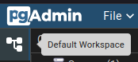
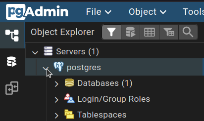
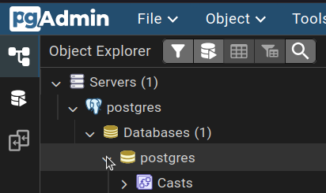
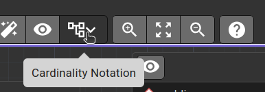
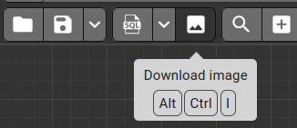
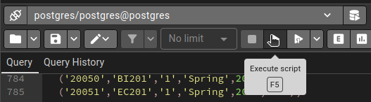

# Lab setup

- [1. Required steps](#1-required-steps)
  - [1.1. Set up `Docker` containers](#11-set-up-docker-containers)
    - [1.1.1. Install `Docker Compose`](#111-install-docker-compose)
    - [1.1.2. Get this repo](#112-get-this-repo)
      - [1.1.2.1. Generate a token](#1121-generate-a-token)
    - [1.1.3. Open the lab directory](#113-open-the-lab-directory)
    - [1.1.4. Create a `.env` file](#114-create-a-env-file)
    - [1.1.5. Start `Docker Desktop`](#115-start-docker-desktop)
    - [1.1.6. Remove old containers](#116-remove-old-containers)
    - [1.1.7. Start all services](#117-start-all-services)
      - [1.1.7.1. Restart a service](#1171-restart-a-service)
- [2. Optional steps](#2-optional-steps)
  - [2.1. Load the data via the SQL script](#21-load-the-data-via-the-sql-script)
    - [2.1.1. Download the data](#211-download-the-data)
    - [2.1.2. Run the SQL script](#212-run-the-sql-script)
  - [2.2. Run the script](#22-run-the-script)
    - [2.2.1. Script for `Lab 8 - Task 4`](#221-script-for-lab-8---task-4)
  - [2.3. Set up `pgAdmin`](#23-set-up-pgadmin)
    - [2.3.1. Connect `pgAdmin` to the database](#231-connect-pgadmin-to-the-database)
    - [2.3.2. Go to `postgres`](#232-go-to-postgres)
    - [2.3.3. Get ERD in Chen notation](#233-get-erd-in-chen-notation)
    - [2.3.4. Run queries](#234-run-queries)
    - [2.3.5. Open the new database](#235-open-the-new-database)
  - [2.4. Connect to the database using `VS Code`](#24-connect-to-the-database-using-vs-code)
    - [2.4.1. Install `VS Code`](#241-install-vs-code)
    - [2.4.2. Connect to the database using `VS Code`](#242-connect-to-the-database-using-vs-code)
      - [2.4.2.1. Connect using `ms-ossdata.vscode-pgsql`](#2421-connect-using-ms-ossdatavscode-pgsql)
      - [2.4.2.2. Connect using `mtxr.sqltools`](#2422-connect-using-mtxrsqltools)

## 1. Required steps

> [!NOTE]
> Run commands in `terminal` code blocks in a terminal.

### 1.1. Set up `Docker` containers

#### 1.1.1. Install `Docker Compose`

1. Install [`Docker Compose`](https://docs.docker.com/compose/install).

> [!NOTE]
> If you use `Windows` and need to install `Linux`, run in a terminal:
>
> ```terminal
> wsl --install -d Ubuntu-24.04
> ```

#### 1.1.2. Get this repo

1. Open a terminal (preferable `bash` or `zsh`).
2. If you don't have this repo, to clone this repo,

   run in the terminal:

   ```terminal
   git clone https://github.com/deemp/s26-databases
   ```

   If `git` asks for a password:

   1. [Generate a token](#1121-generate-a-token).
   2. Use it as the password.

3. To enter this repo,

   run in the terminal:

   ```terminal
   cd s26-databases
   ```

4. Pull the latest changes:

   ```terminal
   git pull
   ```

##### 1.1.2.1. Generate a token

> [!NOTE]
> Skip this step if `git` doesn't ask you for a password.

1. Open in a browser <https://github.com/>.
2. Click your profile icon in the top right corner.
3. Click `Settings`.
4. Scroll down until `Developer settings` in the left sidebar.
5. Click `Developer settings`.
6. Click `Personal access tokens`.
7. Click `Tokens (classic)`.
8. Click `Generate new token`.
9. Click `Generate new token (classic)`.
10. Write a note.
11. Go to `Select scopes`.
12. Check the mark near `repo`.
13. Scroll to the page bottom.
14. Click `Generate token`.

#### 1.1.3. Open the lab directory

1. To navigate to the `lab-4` directory,

   run in the terminal:

   ```terminal
   cd lab-4
   ```

#### 1.1.4. Create a `.env` file

1. To copy the `.env.example` file to the `.env` file:

   run in the terminal:

   ```terminal
   cp .env.example .env
   ```

   If you use `PowerShell`, run:

   ```terminal
   copy .env.example .env
   ```

2. (Optional) Edit the `.env` file as necessary.

#### 1.1.5. Start `Docker Desktop`

1. If you use `Docker Desktop`, start it.

   You should see `Engine running` in the lower left corner of the window.

#### 1.1.6. Remove old containers

1. [Open the lab directory](#113-open-the-lab-directory).

2. To remove containers, volumes, images,

   run in the terminal:

   ```terminal
   docker compose down -v --rmi all
   ```

#### 1.1.7. Start all services

1. To start containers,

   run in the terminal:
  
   ```terminal
   docker compose up --build -d
   ```

##### 1.1.7.1. Restart a service

1. To restart a service,

   run in the terminal:
  
   ```terminal
   docker compose up <service-name> --build -d
   ```

   See service names in [`docker-compose.yaml`](./docker-compose.yaml).

## 2. Optional steps

### 2.1. Load the data via the SQL script

#### 2.1.1. Download the data

1. Download the archive: <https://edu.postgrespro.com/demo-medium-en.zip>
2. Unpack it to get `demo-medium-en-20170815.sql`.

#### 2.1.2. Run the SQL script

> [!NOTE]
> Remove `docker exec -i postgres-lab` if you don't use `Docker`.

To execute the SQL script at the path `~/Downloads/demo-medium-en/demo-medium-en-20170815.sql`,

run in the terminal:

- On `Linux` & `macOS`:

  ```terminal
  docker exec -i postgres-lab psql -U postgres -d postgres -p 5432 < ~/Downloads/demo-medium-en/demo-medium-en-20170815.sql
  ```

- On `Windows`:
  
  ```terminal
  Get-Content -Path "~/Downloads/demo-medium-en/demo-medium-en-20170815.sql" -Raw | docker exec -i postgres-lab psql -U postgres -d postgres -p 5432
  ```

### 2.2. Run the script

#### 2.2.1. Script for `Lab 8 - Task 4`

1. To run the script,

   run in the terminal:

   ```terminal
   docker compose run --rm scripts python scripts/lab-8-task-4.py
   ```

### 2.3. Set up `pgAdmin`

#### 2.3.1. Connect `pgAdmin` to the database

1. Wait 2-3 minutes until `pgAdmin` starts.
2. Open `pgAdmin` in a browser: go to <http://localhost:45050>.
3. Log in:
   1. Login: the value of `PGADMIN_DEFAULT_EMAIL` defined in `.env`
   2. Password: the value of `PGADMIN_DEFAULT_PASSWORD` defined in `.env`.
4. Click `Add New Server`.
5. In `General`, set:
   - `Name`: `postgres`
6. In `Connection`, set:
   - `Host name/address`: `postgres` (service name created by `Docker`)
   - `Port`: `5432` (the value of `POSTGRES_PORT` defined in `.env`)
   - `Maintenance database`: `postgres` (the value of `POSTGRES_DB` defined in `.env`)
   - `Username`: `postgres` (the value of `POSTGRES_USER` defined in `.env`)
   - `Password`: `postgres` (the value of `POSTGRES_PASSWORD` defined in `.env`)
7. Click `Save`.

#### 2.3.2. Go to `postgres`

1. Go to `Default Workspace`.

   </img>
2. Go to `Object Explorer`.
3. Go to `Servers`.
4. Unfold (click) `postgres`.

   </img>
5. Unfold (click) `Databases`.
6. Unfold (click) `postgres`.

   </img>

#### 2.3.3. Get ERD in Chen notation

1. [Go to `postgres`](#212-go-to-postgres).
2. Right-click `postgres`.
3. Click `ERD for Database`.
4. Click `Cardinality Notation`.

   </img>
5. Click `Chen Notation`.
6. Click `Image`.
   </img>

#### 2.3.4. Run queries

1. [Go to `postgres`](#212-go-to-postgres).
2. Right-click `postgres`.
3. Click `Query Tool`.
4. Write an `SQL` script.
5. Run the script:

   Click `Execute script`.

   </img>

#### 2.3.5. Open the new database

1. Open `pgAdmin`.
2. Unfold (click) `Servers`.
3. Unfold (click) `postgres`.
4. Unfold (click) `Databases`.

   You should see the `demo` database created by the script.
5. Unfold (click) `demo`.
6. Unfold (click) `Schemas`.
7. Unfold (click) `bookings`.

### 2.4. Connect to the database using `VS Code`

#### 2.4.1. Install `VS Code`

See `VS Code` [installation instructions](https://code.visualstudio.com/download).

#### 2.4.2. Connect to the database using `VS Code`

Connect using any of these methods:

- [Connect using `ms-ossdata.vscode-pgsql`](#2221-connect-using-ms-ossdatavscode-pgsql).
- [Connect using `mtxr.sqltools`](#2222-connect-using-mtxrsqltools).

##### 2.4.2.1. Connect using `ms-ossdata.vscode-pgsql`

1. Install the [`ms-ossdata.vscode-pgsql`](https://marketplace.visualstudio.com/items?itemName=ms-ossdata.vscode-pgsql) extension.
2. In `VS Code` -> `Activity Bar`, click `PostgreSQL`.
3. Click `Add Connection`.
4. In `CONNECT VIA:` -> `Parameters`, set:
   - `SERVER NAME`: `postgres`
   - `USER NAME`: `postgres` (the value of `POSTGRES_USER` defined in `.env`)
   - `PASSWORD`: `postgres` (the value of `POSTGRES_PASSWORD` defined in `.env`)
   - `DATABASE NAME`: `postgres` (the value of `POSTGRES_DB` defined in `.env`)
   - `CONNECTION NAME`: `postgres` (arbitrary name)
5. Click `Advanced`.
6. In `Advanced Connection Settings`:
   - Set `PORT`: `45432` (the value of `POSTGRES_HOST_PORT` defined in `.env`)
   - In `Server`, set:
     - `HOST IP ADDRESS`: `127.0.0.1` (the value of `POSTGRES_HOST_ADDRESS` defined in `.env`)
   - In `SSL`, set:
     - `SSL MODE`: `Disable`
7. Click `Save and connect`.

##### 2.4.2.2. Connect using `mtxr.sqltools`

1. Install the [`mtxr.sqltools`](https://marketplace.visualstudio.com/items?itemName=mtxr.sqltools) extension.
2. Open `VS Code`.
3. Go to the `Activity Bar`.
4. Click the `SQLTools` icon.
5. Click `Add New Connection`.
6. In `Connection Settings`, set:
   - `Connection name`: `postgres` (arbitrary name)
   - `Connection group`: `Servers` (arbitrary name)
   - `Connect using`: `Server and Port`
   - `Server Address`: `127.0.0.1` (the value of `POSTGRES_HOST_ADDRESS` defined in `.env`)
   - `Port`: `45432` (the value of `POSTGRES_HOST_PORT` defined in `.env`)
   - `Database`: `postgres` (the value of `POSTGRES_DB` defined in `.env`)
   - `Username`: `postgres` (the value of `POSTGRES_USER` defined in `.env`)
   - `SSL`: `Disabled`
7. Click `TEST CONNECTION`.
8. Click `Allow`.
9. Enter password.
10. Click `SAVE CONNECTION`.
11. Click `CONNECT NOW`.
