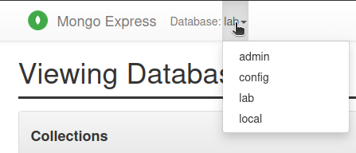

# Lab 10: NoSQL Databases (MongoDB)

## Required steps

<!-- no toc -->
1. [Set up the environment](#set-up-the-environment).
1. [Run services](#run-services).
1. [Import data](#import-data).
1. [Run the script](#run-the-script).

### Set up the environment

1. Copy the environment file and adjust if needed:

   ```sh
   cp .env.example .env.secret
   ```

2. Edit values in `.env.docker.secret`.

   **Tip:** The default values will work too.

### Run services

1. Start the services:

   ```sh
   docker compose --env-file .env.secret up -d
   ```

2. Check that the services are running:

   ```sh
   docker compose --env-file .env.secret ps --format "table {{.Name}}\t{{.Ports}}\t{{.Status}}"
   ```

### Import data

1. Copy the dataset into the container:

   ```sh
   docker cp data/setup/supplies.jsonl mongodb-lab:/tmp/supplies.jsonl
   ```

2. Import it into the database:

   ```sh
   docker exec -it mongodb-lab mongoimport \
     -u $MONGO_USER -p $MONGO_PASSWORD --authenticationDatabase admin \
     --db $MONGO_DB --collection $MONGO_COLLECTION --file /tmp/supplies.jsonl
   ```

### Run the script

1. Install [uv](https://docs.astral.sh/uv/getting-started/installation/).

2. Install dependencies:

   ```sh
   uv sync
   ```

3. Write solutions in [`main.py`](./main.py).

4. Run the script:

   ```sh
   uv run python main.py
   ```

## Optional steps

<!-- no toc -->
- [Run a command inside the `MongoDB` container](#run-a-command-inside-the-mongodb-container).
- [Explore the `lab` database](#explore-the-lab-database).

### Run a command inside the `MongoDB` container

1. Connect to the MongoDB shell inside the running container:

   ```sh
   docker exec -it mongodb-lab mongosh -u $MONGO_USER -p $MONGO_PASSWORD
   ```

   - `docker exec -it mongodb-lab` — runs a command inside the `mongodb-lab` container with an interactive terminal
   - `mongosh` — the MongoDB shell client
   - `-u $MONGO_USER -p $MONGO_PASSWORD` — authenticates with the credentials from `.env.secret`

### Explore the `lab` database

1. Open Mongo Express at <http://localhost:8081> (login with `MONGOEXPRESS_USER` / `MONGOEXPRESS_PASSWORD` from `.env.secret`).

2. Select the `lab` database.

   

3. Click `View`.

4. Click `Advanced`.

5. Write a query, e.g.:

   ```json
   { "couponUsed": true }
   ```

6. Click `Find`.
