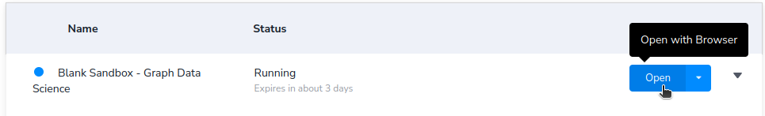

# `Neo4j`

<h2>Table of contents</h2>

- [Set up `Neo4j` using `Sandbox`](#set-up-neo4j-using-sandbox)
  - [Create a `Neo4j` instance using `Sandbox`](#create-a-neo4j-instance-using-sandbox)
  - [Open the `Neo4j Browser` in the `Sandbox`](#open-the-neo4j-browser-in-the-sandbox)
- [Set up `Neo4j` using `Docker Compose`](#set-up-neo4j-using-docker-compose)
  - [Enter the `neo4j` directory](#enter-the-neo4j-directory)
  - [Set up the environment](#set-up-the-environment)
  - [Run `Docker Compose` services](#run-docker-compose-services)
  - [Open the `Neo4j Browser` on `localhost`](#open-the-neo4j-browser-on-localhost)
- [Use the `Neo4j Browser`](#use-the-neo4j-browser)
  - [Set up the movies database in the `Neo4j Browser`](#set-up-the-movies-database-in-the-neo4j-browser)
  - [Run a query or a script in the `Neo4j Browser`](#run-a-query-or-a-script-in-the-neo4j-browser)
- [Connect to `Neo4j` using `VS Code`](#connect-to-neo4j-using-vs-code)
  - [Connect to the `Neo4j` instance in `VS Code`](#connect-to-the-neo4j-instance-in-vs-code)
  - [Run a query in the file](#run-a-query-in-the-file)
  - [Run all queries in the file](#run-all-queries-in-the-file)

## Set up `Neo4j` using `Sandbox`

> [!CAUTION]
> The sandbox lives only up to 3 days.

1. [Create a `Neo4j` instance using `Sandbox`](#create-a-neo4j-instance-using-sandbox).
2. [Open the `Neo4j Browser` in the `Sandbox`](#open-the-neo4j-browser-in-the-sandbox).
3. [Set up the movies database in the `Neo4j Browser`](#set-up-the-movies-database-in-the-neo4j-browser).
4. [Run a query or a script in the `Neo4j Browser`](#run-a-query-or-a-script-in-the-neo4j-browser).

### Create a `Neo4j` instance using `Sandbox`

1. Open <https://sandbox.neo4j.com/> in the browser.

2. Sign up.

3. Go to <https://sandbox.neo4j.com/>.

4. Click `New Project`.

5. Select `Blank Sandbox - Graph Data Science`.

6. Click `Create and Download credentials`.

   Credentials should be downloaded in a `.txt` file.

### Open the `Neo4j Browser` in the `Sandbox`

1. Go to <https://sandbox.neo4j.com/>.

2. Click `Open`

   

3. Set the values using the values of variables in the downloaded credentials file:

   - `Database user`: `NEO4J_USERNAME`

   - `Password`: `NEO4J_PASSWORD`

4. Click `Connect`.

## Set up `Neo4j` using `Docker Compose`

1. [Enter the `neo4j` directory](#enter-the-neo4j-directory).
2. [Set up the environment](#set-up-the-environment).
3. [Run `Docker Compose` services](#run-docker-compose-services).
4. [Open the `Neo4j Browser` on `localhost`](#open-the-neo4j-browser-on-localhost).
5. [Set up the movies database in the `Neo4j Browser`](#set-up-the-movies-database-in-the-neo4j-browser).
6. [Run a query or a script in the `Neo4j Browser`](#run-a-query-or-a-script-in-the-neo4j-browser).

### Enter the `neo4j` directory

1. Clone this repository:

   ```terminal
   git clone https://github.com/deemp/s26-databases
   ```

2. Enter the `neo4j` directory:

   ```terminal
   cd s26-databases/neo4j
   ```

### Set up the environment

1. Create the env file:

   ```terminal
   cp .env.example .env
   ```

2. Set `NEO4J_PASSWORD` in `.env`.

### Run `Docker Compose` services

1. Start `Docker Desktop`.

2. Start the services.

   ```terminal
   docker compose up -d
   ```

### Open the `Neo4j Browser` on `localhost`

1. Open <http://localhost:7474> in the browser.

## Use the `Neo4j Browser`

Actions:

- [Set up the movies database in the `Neo4j Browser`](#set-up-the-movies-database-in-the-neo4j-browser)
- [Run a query or a script in the `Neo4j Browser`](#run-a-query-or-a-script-in-the-neo4j-browser)

### Set up the movies database in the `Neo4j Browser`

1. Copy the text from [`movies.cypher`](./cypher/movies.cypher).

   Source: [`AhmadTaha96/movies.cypher`](https://gist.github.com/AhmadTaha96/b3e3c033a462a37a582ec80213f42ae7)

2. Paste it into the query field (`neo4j$`) in the browser.

3. To run the script, press `Enter` or click the `Run` button in the top right corner.

### Run a query or a script in the `Neo4j Browser`

1. Paste the query or the script into the query field (`neo4j$`).

   See query examples in [`cypher/examples.cypher`](./cypher/examples.cypher).

2. To execute the query, press `Enter` or click the `Run` button in the top right corner.

## Connect to `Neo4j` using `VS Code`

> [!IMPORTANT]
> Assumption: you [set up `Neo4j` using `Docker Compose`](#set-up-neo4j-using-docker-compose).

1. [Connect to the `Neo4j` instance in `VS Code`](#connect-to-the-neo4j-instance-in-vs-code).
2. [Run a query in the file](#run-a-query-in-the-file).
3. [Run all queries in the file](#run-all-queries-in-the-file).

### Connect to the `Neo4j` instance in `VS Code`

1. Install the `VS Code` extension `neo4j-extensions.neo4j-for-vscode`.

2. Run using the `Command Palette`: `Neo4j: Create new connection`.

3. Set the values:

   - `Display name`: `Movies`

   - `Scheme`: `neo4j://`

   Use the values from `.env`:

   - `Host`: `NEO4J_HOST_ADDRESS`

   - `Port`: `NEO4J_BOLT_PORT`

   - `User`: `NEO4J_USER`

   - `Password`: `NEO4J_PASSWORD`

4. Click `Save & Connect`.

### Run a query in the file

1. Open [`cypher/examples.cypher`](./cypher/examples.cypher).

2. Select the `Example 1` query.

3. To run the selected query, press `Ctrl+Enter`.

### Run all queries in the file

1. To run all queries in the file, press `Ctrl+Alt+Enter`.
